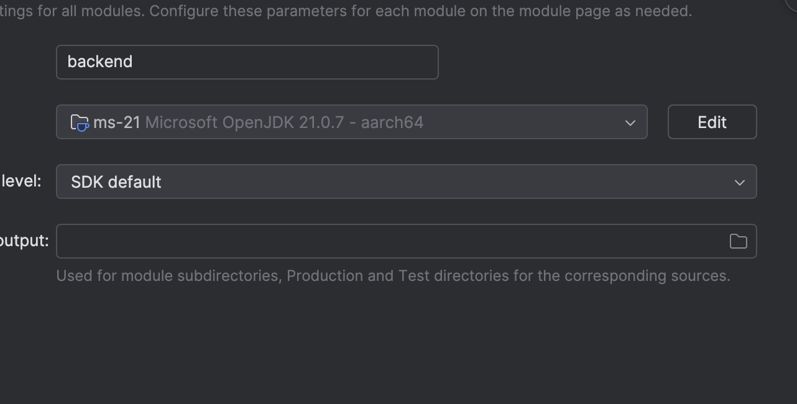

# OOP Auth Project

This project includes:

- A **Spring Boot backend** (Java)
- A **React frontend** (Vite + Axios)
- A **PostgreSQL database in Docker**
- Colima for macOS Docker support (for M1/M2 Macs)

---

## 🧰 Prerequisites

> The following tools must be installed on your system:

### 1. Homebrew (macOS package manager) asta a dat chatgpt poti sa cauti pe google ca sa iei latest version

If not installed:

```bash
/bin/bash -c "$(curl -fsSL https://raw.githubusercontent.com/Homebrew/install/HEAD/install.sh)"
```

### 2. Java (Microsoft OpenJDK 21)

Make sure Java 21 is installed.

poti sa instalezi in intelij, file, project structure si gradle daca apare eroare se seteaza automat idk tho ar trb sa mearga


### 4. Node.js & npm (for React)

```bash
brew install node
```

### 5. Docker + Colima asta e de moment ca sa vezi ca merge proiectul dar poti sai arati ar fi un punct in plus daca poti sa citesti un pic despre docker ar fi perfect ca nu e nmc greu si e mai ok doar sa stii sa explici

Install Docker CLI:

```bash
brew install docker
```

Install Colima (Docker VM for macOS, esp. for M1/M2 chips):

```bash
brew install colima
```

Start Colima:

```bash
colima start --cpu 4 --memory 4 --vm-type vz --mount-type virtiofs
```

---

## 🐘 PostgreSQL with Docker

From the project root, run:

```bash
docker-compose up -d
```

This will:

- Create a container called `oop-db`
- Expose PostgreSQL at `localhost:5433`
- Use credentials:
  - **Database**: `oop`
  - **Username**: `newuser`
  - **Password**: `password`

Verify it's running:

```bash
docker ps
```

---

## 🧠 Backend (Spring Boot)

### 1. Navigate to the backend folder (if it's in a subdirectory)

### 2. Create the file `src/main/resources/application.properties` with:

```properties
spring.datasource.url=jdbc:postgresql://localhost:5433/oop
spring.datasource.username=newuser
spring.datasource.password=password
spring.datasource.driver-class-name=org.postgresql.Driver

jwt.secret=secret
jwt.expiration=86400000
spring.jpa.hibernate.ddl-auto=update
```

### 3. Run the backend:


> The backend will start at: `http://localhost:8080`

---

## 🎨 Frontend (React + Vite)

### 1. Navigate to `frontend/` (or wherever your React code is)

### 2. Install dependencies:

```bash
npm install
```

### 3. Run the development server:

```bash
npm run dev
```

> The frontend runs at: `http://localhost:5173`

---

## 🚀 You're all set!

Once all parts are running:

- Open the React frontend
- Register or log in with credentials
- You’ll get a token and user info back

Enjoy!
# Spring-React-project
